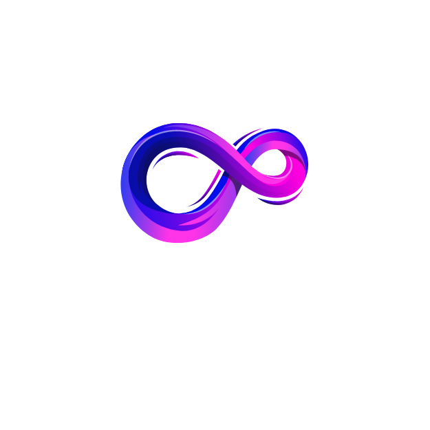

<div align="center">
  <a href="https://ithreem.com/">
    
  </a>
  <h1>IThreeM - Decentralized Gaming Engine</h1>
</div>


Start the Engine. Three binaries are available:
1. I3M-Engine-Core
2. I3M-CLI
3. I3M-Project-Manager: Still in development and crafting stages
```bash
cargo run --bin
```
